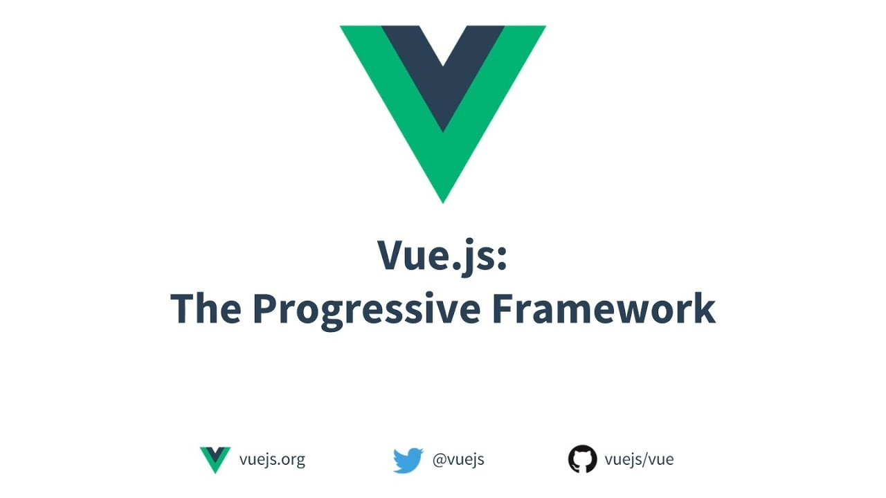
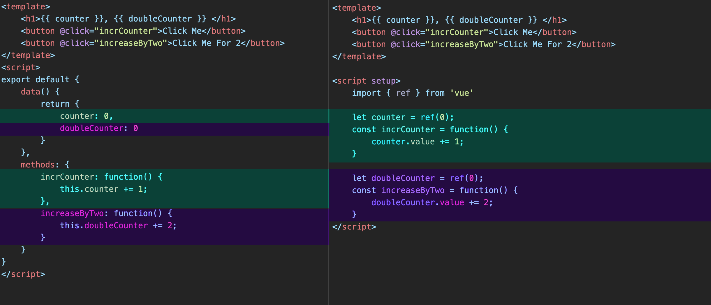
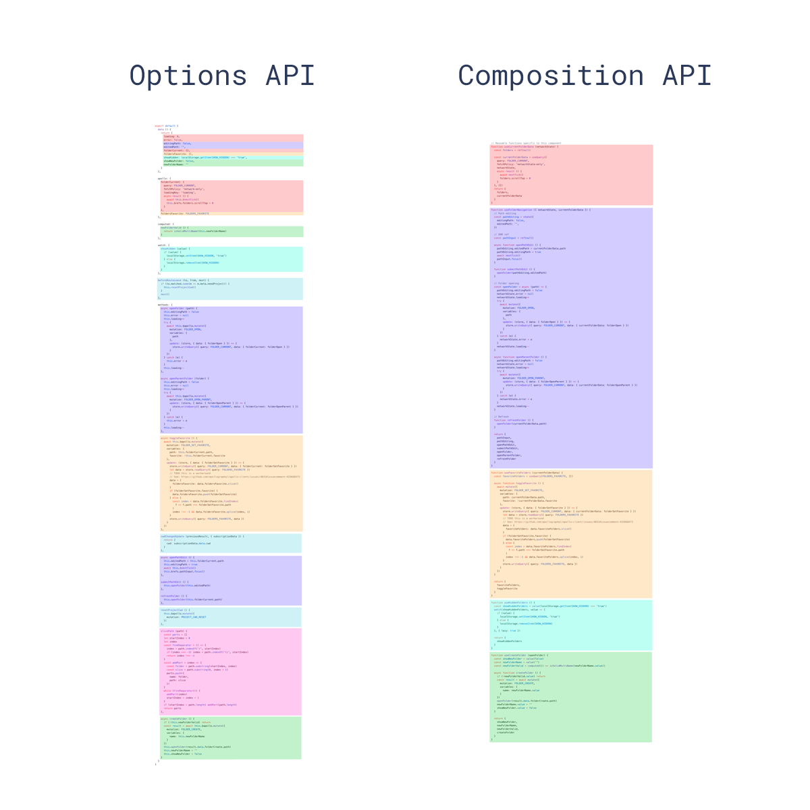

# Vue.js - Presentation from JBM


---

<div
  v-motion
  :initial="{ x: -80, y:80, opacity: 0 }"
  :enter="{ x: 0, y:0, opacity: 1, transition: {
    type: 'spring',
    damping: 5,
    stiffness: 20,
    mass: 3,
    delay: 1000, 
    duration: 2000
   } }">
  
</div>
  <br>
<div
  v-motion
  :initial="{ x: 80, y:80, opacity: 0 }"
  :enter="{ x: 0, y:0, opacity: 1, transition: {
    type: 'spring',
    damping: 5,
    stiffness: 20,
    mass: 3,
    delay: 1000, 
    duration: 2000
   } }">
  
</div>


---
theme: vuetiful
layout: two-cols
---

# 1 - Hello World 

Der Kern von Vue.js ist ein System, das es uns ermöglicht, Daten deklarativ an das DOM zu rendern, 
indem wir eine einfache syntax template verwenden:
```js
<div id="app">
  {{ message }}
</div>
```
Vue2
```js
var app = new Vue({
  el: '#app',
  data: {
    message: 'Hello Vue!'
  }
})
```

<HelloWorld/>

::right::

#
<br>
Eine Instanz wird mit der Eigenschaft el an einen HTML-Knoten gebunden
<br>
<br>
<br>
Vue 3 is faster, smaller, more maintainable and it’s easier to target native — Evan Vue
<br>
<br>

```js
<div id="app">
  {{ message }}
</div>
```
Vue 3
```js
import { createApp } from 'vue'

createApp({
  data() {
    return { message: 'Hello Vue!' }
  }
}).mount('#app')
```


---
theme: vuetiful
layout: two-cols
---

# 2 - Declarative Rendering 
with the option API

```js {monaco}
<script>
export default {
  data() {
    return {
      message: 'Hello World!',
      counter: {
        count: 0
      }
    }
  }
}
</script>

<template>
  <h1>{{ message }}</h1>
  <p>Count is: {{ counter.count }}</p>
</template>
```

::right::

#

Was wir im Editor sehen, ist eine Vue Single-File Component (SFC).

Das Kernfeature von Vue ist das deklarative Rendering: Mithilfe einer Template-Syntax, die HTML erweitert, können wir basierend auf dem JavaScript-Status beschreiben, wie das HTML aussehen soll. 

State, die bei Änderung Aktualisierungen auslösen können, gelten als reaktiv. In Vue wird der reaktive State in Komponenten gehalten.


<DeclarativeRendering/>

---
theme: vuetiful
layout: two-cols
---

# 2 bis - Declarative Rendering 
with the Composition API


```js {monaco}
<script setup>
import { reactive, ref } from 'vue'

const counter = reactive({ count: 0 })
const message = ref('Hello World!')
</script>

<template>
  <h1>{{ message }}</h1>
  <p>Count is: {{ counter.count }}</p>
</template>
```
::right::

#
<br>
<br>
<br>
Reactive() funktioniert nur bei Objekten.

<br>
Ref() hingegen kann jeden Werttyp annehmen und ein Objekt erstellen, 
das den inneren Wert unter einer value-Eigenschaft offenlegt
<br>
<br>
<br>
<DeclarativeRendering/>
---
theme: vuetiful
layout: two-cols
---

# 3 - Attibute Bindings 
with the option API


```js {monaco}
    <script>
    export default {
      data() {
        return {
          titleClass: 'title'
        }
      }
    }
    </script>
    <template>
      <h1 :class="titleClass">Make me red</h1>
    </template>
    <style>
    .title {
      color: red;
    }
    </style>
```
::right::

#

In Vue werden "mustaches" nur zur Textinterpolation verwendet. Um ein Attribut an einen dynamischen Wert zu binden, verwenden wir die v-bind-Direktive:
```js
<div v-bind:id="dynamicId"></div> 
```
Da v-bind so häufig verwendet wird, hat es eine dedizierte Abkürzungssyntax:
```js
<div :id="dynamicId"></div>
```

<AttributeBindings/>

---
theme: vuetiful
layout: two-cols
---

# 3 bis - Attibute Bindings 
with the composition API


```js {monaco}
<script setup>
import { ref } from 'vue'

const titleClass = ref('title-red')
</script>

<template>
  <h1 :class="titleClass">Make me red</h1>
</template>

<style>
.title-red {color: red; }
.title-blue {color: blue; }
</style>
```
::right::

#

In Vue, mustaches are only used for text interpolation. To bind an attribute to a dynamic value, we use the v-bind directive: 
```js
<div v-bind:id="dynamicId"></div> 
```
Because v-bind is used so frequently, it has a dedicated shorthand syntax :
```js
<div :id="dynamicId"></div>
```

<AttributeBindings/>
---
theme: vuetiful
layout: two-cols
---

# 4 - Event Listeners 
with the option API
<br>
<br>
<br>
<EventListener/>
<br>
<br>

Wir können DOM-Ereignisse mit der v-on-Direktive abhören:
```js
<button v-on:click="increment">{{ count }}</button>
```
Aufgrund seiner häufigen Verwendung hat v-on auch eine abgekürzte Syntax:
<br>
```js
<button @click="increment">{{ count }}</button>
```

::right::

#

```js {1,3,4,5,14|8,9,10|16,17,18,19,20}
<script>
export default {
  data() {
    return {
      count: 0
    }
  },
  methods: {
    increment() {
      this.count++
    }
  }
}
</script>

<template>
  <button v-on:click="increment">
  count is: {{ count }}
  </button>
</template>
```

---
layout: two-cols
---

# 4 bis - Event Listeners 
with the compoition API
<br>
<br>
<br>
<EventListener/>

::right::

# 


```js {1,2,7|9,10,11|3,4,5}
<script setup>
import { ref } from 'vue'
const count = ref(0)
function increment() {
  count.value++
}
</script>

<template>
  <button @click="increment">count is: {{ count }}</button>
</template>
```

---
preload: false
layout: two-cols
---


# Option API   versus
<h1>composition API</h1>

<div
  v-motion
  :initial="{ x: -80, y:80, opacity: 0 }"
  :enter="{ x: 0, y:0, opacity: 1, transition: {
    type: 'spring',
    damping: 5,
    stiffness: 20,
    mass: 3,
    delay: 1000, 
    duration: 2000
   } }">
  
</div>
  <br>
<div
  v-motion
  :initial="{ x: 80, y:80, opacity: 0 }"
  :enter="{ x: 0, y:0, opacity: 1, transition: {
    type: 'spring',
    damping: 5,
    stiffness: 20,
    mass: 3,
    delay: 1000, 
    duration: 2000
   } }">
  
</div>

::right::

#

<div
  v-motion
  :initial="{ x: 80, y:-80, opacity: 0 }"
  :enter="{ x: 0, y:0, opacity: 1, transition: {
    type: 'spring',
    damping: 5,
    stiffness: 20,
    mass: 3,
    delay: 1000, 
    duration: 2000
   } }">
  
</div>
- organisation
<br>
- wieder verwendbachen Composables

---
layout: two-cols
---

# 5 - Form Bindings 

<FormBindings/>
<br>
<br>
Durch die gemeinsame Verwendung von v-bind und v-on können wir bidirektionale Bindungen für Formulareingabeelemente erstellen:
```js
<input :value="text" @input="onInput">
```
v-model synchronisiert automatisch den Wert von "input" mit dem gebundenen Zustand, 
sodass wir dafür keinen Event-Handler mehr verwenden müssen.
```js
<input v-model="text">
```

::right::

# 


```js 
<script setup>
import { ref } from 'vue'

const text = ref('')
</script>

<template>
  <input v-model="text" placeholder="Type here">
  <p>{{ text }}</p>
</template>
```


---
layout: two-cols
---

# 6 - Conditional Rendering 
 
<br>
<ConditionalRendering/>
<br>
<br>
Wir können die v-if-Direktive verwenden, um ein Element bedingt zu rendern:
```js
<h1 v-if="awesome">Vue is awesome!</h1>
```
 If awesome changes to a falsy value, it will be removed from the DOM.
```js
<h1 v-if="awesome">Vue is awesome!</h1>
<h1 v-else>Oh no 😢</h1>
```

::right::

# 


```js 
<script setup>
import { ref } from 'vue'

const awesome = ref(true)

function toggle() {
  awesome.value = !awesome.value
}
</script>

<template>
  <button @click="toggle">toggle</button>
  <h1 v-if="awesome">Vue is awesome!</h1>
  <h1 v-else>Oh no 😢</h1>
</template>
```
---

# 7 - List Rendering
<ListRendering/>

Wir können die Direktive v-for verwenden, um eine Liste von Elementen basierend auf einem Quellarray zu rendern.
```js {4,15,16,17|5,6,7|20,21,22,23|8,9,10,11,12|all} {maxHeight:'100'}
<script setup>
import { ref } from 'vue'
let id = 0 
const newTodo = ref('')
const todos = ref([
  { id: id++, text: 'Learn HTML' },
  { id: id++, text: 'Learn JavaScript' },])
function addTodo() {
  todos.value.push({ id: id++, text: newTodo.value })
  newTodo.value = ''}
function removeTodo(todo) {
  todos.value = todos.value.filter((t) => t !== todo)}
</script>
<template>
  <form @submit.prevent="addTodo">
    <input v-model="newTodo">
    <button>Add Todo</button>    
  </form>
  <ul>
    <li v-for="todo in todos" :key="todo.id">
      {{ todo.text }}
      <button @click="removeTodo(todo)">X</button>
    </li>
  </ul>
</template>
```
<br>
Die eindeutige ID ermöglicht es Vue, jedes "li" genau zu verschieben, um es an die Position seines entsprechenden Objekts im Array anzupassen.
<br>

---

# 8 - Computed Property

<ComputedProperty/>

Wir können eine computed() ref erstellen, die ihren .value basierend auf anderen data sources berechnet:

```js {maxHeight:"100"}
const filteredTodos = computed(() => {
  // return filtered todos based on
  // `todos.value` & `hideCompleted.value`
})
```
Eine computed() Eigenschaft verfolgt andere reaktive State.
Das Ergebnis wird zwischengespeichert und automatisch aktualisiert, wenn sich seine Abhängigkeiten ändern.

---

# 8 - Computed Property

<ComputedProperty/>

```js {5|12,13,14,15,16|40,41,42} {maxHeight:'100'}
<script setup>
import { ref, computed } from 'vue'
let id = 0
const newTodo = ref('')
const hideCompleted = ref(false)
const todos = ref([
  { id: id++, text: 'Learn HTML', done: true },
  { id: id++, text: 'Learn JavaScript', done: true },
  { id: id++, text: 'Learn Vue', done: false }
])

const filteredTodos = computed(() => {
  return hideCompleted.value
    ? todos.value.filter((t) => !t.done)
    : todos.value
})

function addTodo() {
  todos.value.push({ id: id++, text: newTodo.value, done: false })
  newTodo.value = ''
}

function removeTodo(todo) {
  todos.value = todos.value.filter((t) => t !== todo)
}
</script>

<template>
  <form @submit.prevent="addTodo">
    <input v-model="newTodo">
    <button>Add Todo</button>
  </form>
  <ul>
    <li v-for="todo in filteredTodos" :key="todo.id">
      <input type="checkbox" v-model="todo.done">
      <span :class="{ done: todo.done }">{{ todo.text }}</span>
      <button @click="removeTodo(todo)">X</button>
    </li>
  </ul>
  <button @click="hideCompleted = !hideCompleted">
    {{ hideCompleted ? 'Show all' : 'Hide completed' }}
  </button>
</template>

<style>
.done {
  text-decoration: line-through;
}
</style>
```

---
theme: vuetiful
---

# 9 - Components + props

Real Vue-Anwendungen werden normalerweise mit verschachtelten Komponenten erstellt.
Eine child Komponente kann Eingaben von der parent Komponente via props.

Um einen dynamischen Wert zu übergeben, können wir auch die v-bind-Syntax verwenden.
```js
<script setup>
import { ref } from 'vue'
import ChildComp from './ChildComp.vue'

const greeting = ref('Hello from parent')
</script>

<template>
  <ChildComp :msg="greeting" />
</template>
```

---
theme: vuetiful
---

# 9 - Components + props

Real Vue-Anwendungen werden normalerweise mit verschachtelten Komponenten erstellt.
Eine child Komponente kann Eingaben von der parent Komponente via props.

Um einen dynamischen Wert zu übergeben, können wir auch die v-bind-Syntax verwenden.
```js
<script setup>
import { ref } from 'vue'
import ChildComp from './ChildComp.vue'

const greeting = ref('Hello from parent')
</script>

<template>
  <ChildComp :msg="greeting" />
</template>
```

---
theme: vuetiful
layout: two-cols
---

# 10 - Slots

Zusätzlich zur Weitergabe von Data via props, kann die parent Komponente auch Template Fragments 
über Slots an die untergeordnete Komponente weitergeben:


```js
<script setup>
import { ref } from 'vue'
import ChildComp from './ChildComp.vue'

const msg = ref('from parent')
</script>

<template>
  <ChildComp></ChildComp>
</template>
```
<br>

::right::

#
"./ChildComp.vue"
```js
<template>
    <button class="button">
        <slot />
    </button>
</template>
```
<br>
<br>
<br>
<Slots/>